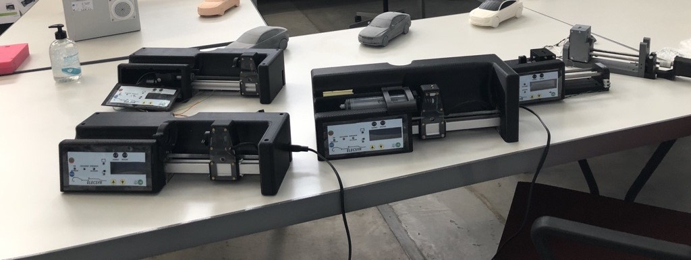

# PSE20-HW

All the files in this directory (and its subdirectories) are subject to
the CERN-OHL-S v2 licence.

Copyright Renault SAS 2020.

This source describes Open Hardware and is licensed under the CERN-OHL-S v2.
You may redistribute and modify this documentation and make products
using it under the terms of the CERN-OHL-S v2 (https:/cern.ch/cern-ohl).

This documentation is distributed WITHOUT ANY EXPRESS OR IMPLIED
WARRANTY, INCLUDING OF MERCHANTABILITY, SATISFACTORY QUALITY
AND FITNESS FOR A PARTICULAR PURPOSE. Please see the CERN-OHL-S v2
for applicable conditions.

This repository contains the Design files for the CAD and Electronic elements of the PSE20-HW project.

For a detailed description of the ELECSYR syringe pump, please refer to [the specification](documentation/Specification\ Elecsyr_ENG.pdf).

